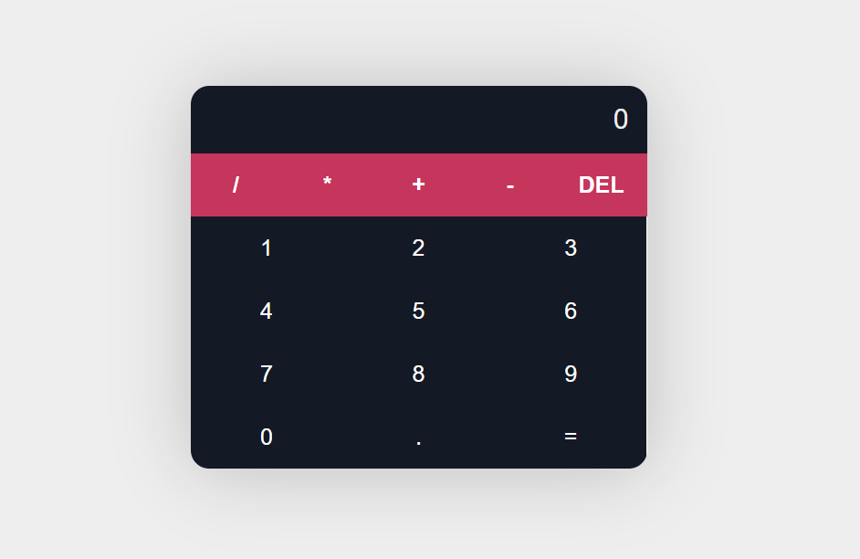

<!-- Add your logo here -->

# Calculator App

A simple calculator application built with React.

## Description

This calculator app allows users to perform basic arithmetic calculations such as addition, subtraction, multiplication, and division. It provides a user-friendly interface where users can input their calculations and view the results instantly.

## Features

- Addition, subtraction, multiplication, and division operations
- Error handling for invalid calculations
- Delete last entered digit or operator
- Support for decimal numbers
- Clear button to reset the calculation

## Installation

To run this application locally, follow these steps:

1. Clone the repository: `git clone https://github.com/your-username/calculator-app.git`
2. Navigate to the project directory: `cd calculator-app`
3. Install the dependencies: `npm install`
4. Start the development server: `npm start`
5. Open your browser and visit: `http://localhost:3000`

## Usage

1. Enter your calculation in the display area.
2. Use the digit buttons to enter numbers.
3. Use the operator buttons to perform operations.
4. Press the "=" button to calculate the result.
5. Press the "DEL" button to delete the last entered digit or operator.
6. Press the "C" button to clear the calculation.

## Technologies Used

- React
- JavaScript
- HTML
- CSS

## Screenshots

<!-- Add more screenshots if necessary -->

## License

This project is licensed under the [MIT License](LICENSE).

<!-- Add credits, acknowledgments, or any additional information here -->
